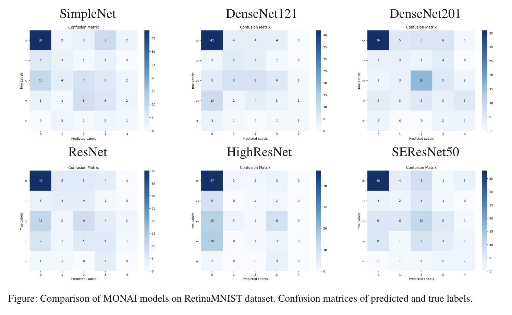

# RetinaMNIST Disease Classification with MONAI Models

## Motivation
Diabetic retinopathy (DR) is a leading cause of blindness among adults with diabetes, yet its early detection remains a major challenge. Low adherence to retinal screening means that many cases are not diagnosed until they reach advanced, vision-threatening stages, limiting treatment options. Early diagnosis is critical to preventing severe vision loss, but many patients fail to undergo regular screenings.

Artificial intelligence (AI) offers a promising solution to this problem by enabling faster, more accurate detection of DR through retinal imaging. However, machine learning algorithms still face significant challenges, particularly with complex datasets like RetinaMNIST, which is notoriously difficult for AI models to predict. Overcoming these challenges is key to developing more reliable, accessible, and efficient AI-driven screening tools.

Improving AI models for DR detection has the potential to revolutionize screening practices, making early diagnosis more feasible and reducing the risk of preventable blindness in diabetic patients.

## Previous Work
One notable approach is the use of Vision Transformers (ViT) for classifying 2D biomedical images. A study (Halder et al., 2024) compared the ViT-Base-Patch16-2249 model against benchmark accuracies, achieving a new benchmark accuracy of 57% on retinal images, highlighting the potential of ViT in DR classification.

https://www.nature.com/articles/s41598-024-63094-9 

In a separate study, deep convolutional neural networks (CNNs) were applied to predict the worsening of DR based on fundus images acquired at a single visit. Accuracy was slightly better than random guessing (Neghawi et al., 2024). 

https://www.mdpi.com/2673-2688/5/4/111

Another significant contribution is MedViT, a hybrid model combining Convolutional Neural Networks (CNNs) and Vision Transformers for medical image classification. This approach demonstrated increased robustness and generalization compared to state-of-the-art methods, particularly on large-scale standardized datasets like RetinaMNIST. Despite less computational complexity, MedViT showed strong resilience in handling the challenges posed by DR classification, though detailed accuracy results were not publicly available due to access restrictions. (Manzari et al., 2023).

https://pubmed.ncbi.nlm.nih.gov/36958234/

Unified Model Agnostic Computation (UMAC), using the MedMNIST+ dataset, addressed the challenges of retinal image classification. Despite various advanced techniques, the RetinaMNIST dataset remains one of the most difficult for AI models to handle, with benchmark accuracies still hovering around 50%. For example, methods like ISDA and UMAC with Self-Supervised Learning achieved accuracy rates of 52.6% and 51.3%, respectively, while the best-performing model, BSDA, reached only 53.3% (Manzari et al., 2024).

https://pubmed.ncbi.nlm.nih.gov/36958234/

## Objective 
The objective of this analysis is to use existing MONAI classification models to generate greater accuracy with the RetinaMNIST dataset than previous work has done. 

## Methods
### Dataset
The model used in this analysis is the RetinaMNIST dataset. It is structured as follows:

Split - 1,080/120/400 (1,600 total)
- Train/Validation/Test
  
Image size - 3 x 28 x 28
- 3 → RGB
- 28 x 28 → Image Dimensions
  
Task - Original Regression (5)
- Disease Classification Scale of 1-5

### Proposed Pipeline

### Models
**SimpleNet**

A lightweight neural network framework or architecture used for educational purposes or as a starting point for small-scale machine learning projects. It’s designed to be simple to understand and easy to implement, making it ideal for learning about the basics of neural networks, training algorithms, and deep learning. 

**DenseNet**

A deep learning architecture that connects each layer to every other layer in a dense, direct fashion. In other words, each layer receives input from all previous layers and passes its own feature maps to all subsequent layers.

Variations:
- DenseNet121 - 121 layers
- DenseNet201 - 201 layers

**ResNet**

A deep learning architecture designed to address the challenges of training very deep neural networks. It introduces the concept of residual learning, which helps mitigate the problems of vanishing gradients and degradation of accuracy as the network depth increases. Instead of directly learning the mapping of input to output, ResNet layers learn the residual (or difference) between the input and the desired output. This allows the network to focus on learning incremental changes rather than learning the entire transformation.

Variations:
- HighResNet - enhances ResNet by focusing on maintaining higher resolution features to improve spatial accuracy, especially for tasks like segmentation.
- SEResNet50 - improves ResNet by adding the Squeeze-and-Excitation module to improve channel-wise feature selection and enhance the network's ability to focus on the most relevant features.

## Results
### Performance Comparison

All models reached a training accuracy of 100% within 200 epochs other than SimpleNet and HighResNet. SimpleNet likely would need more epochs to reach 100% training accuracy because of its simplicity. HighResNet likely did not reach 100% training accuracy because of a runtime disconnect that occured while running the training loop.

The ideal confusion matrix above would be dark blue along the upper left to lower right diagonal. This would indicate true positives and true negatives which indicate the model is identifying DR correctly. Models performed with 36-47% accuraccy when identifying an DR score of 0 (no DR). All models were significantly worse at identifying true negatives for all other DR scores, averaging about 7% accuracy. The DenseNet models had the most true positives.  

### Example Predictions

We can see that none of the models are doing that good at predicting. Again the most accurate predictions are for DR 0. 

### Saliency

## Limitations
- Small dataset
- Small number of epochs
- High learning rate
